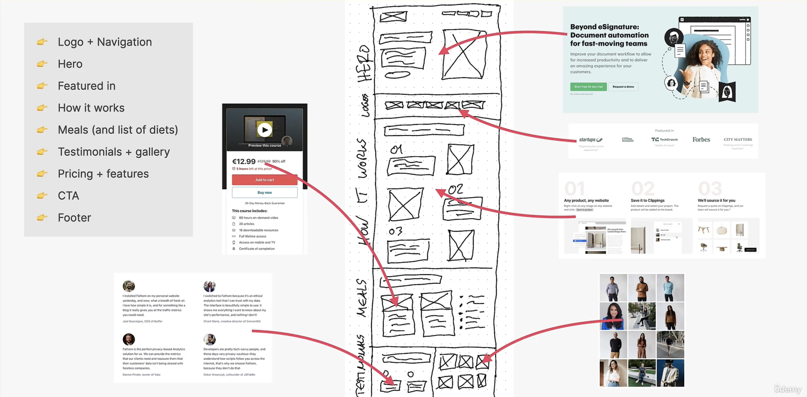

# html-css

> Build responsive real-word websites with HTML and CSS.
>
> Udemy：https://www.udemy.com/course/design-and-develop-a-killer-website-with-html5-and-css3/
>
> Bilibili：https://b23.tv/bUiw1bZ

## 建立网站(Omnifood)的过程

### 1. 定义项目

- 定义网站为谁而做

  > 为公司客户

- 定义网站的用途

  > 商业目标：每月销售食谱订阅
  >
  > 用户目标：不费大量的时间和金钱就能吃得好

- 定义目标受众。

  > 喜欢技术，对健康饮食感兴趣的忙碌的人，并且有份高薪工作

### 2. 计划项目

- 计划和收集网站内容

  > [Omnifood Content](Omnifood/content.md)
  >
  > [Omnifood Img](Omnifood/img)

- 规划网站地图

  > 我们将只建立一个网页营销网站，因此没有网站地图

- 定义网站个性。

  > 基于以技术为中心的目标受众，以及正在销售的实际产品，我们将使用 **初创公司/乐观** 的个性。因为产品也关乎消费者的身体健康，我们可能会添加一些 **冷静/平和** 的个性元素

- 计划页面分区

  > 导航—>横幅—>重要作用—>如何工作的—>膳食(和饮食列表)—>推荐+陈列—>定价+功能—>行为号召—>页脚

### 3. 草图布局和组件思想

- 思考你需要什么组件，以及如何在布局模式中使用它们

- 理出你的想法：用笔和纸或一些设计软件（例如：Figma）

  > 

### 4. 设计和建立网站

- 使用步骤 1、2 和 3 中的决策、内容和草图，使用 HTML 和 CSS 设计和构建网站。
  > [index.html](Omnifood/index.html)
  > 
  > [style.css](Omnifood/css/style.css)
  > 
  > [general.css](Omnifood/css/general.css)
  > 
  > [queries.css](Omnifood/css/queries.css)

### 5. 测试和优化

- 确保网站在所有主要浏览器中都能正常运行（Chrome、Firefox、Safari、Edge，甚至旧的 IE）
- 在实际的移动设备上测试网站
- 根据尺寸和文件大小优化所有图像
- 在 Chrome DevTools 中运行 Lighthouse 性能测试，并修复报告的问题
- 考虑搜索引擎优化（SEO）

### 6. 启动网站

- 所有的工作完成并且得到批准后，启动网站（可使用网站托管平台，例如：Netlify）
- 选择并购买一个能很好地代表品牌、令人难忘且易于书写的域名

  > https://omnifood-wanyh.netlify.app/

### 7. 维护并不断更新网站

- 更新网站内容
- 安装分析软件（如 Google analytics 或 Fathom）以获取网站用户的统计数据。这可以为网站结构和内容的未来变化提供信息
